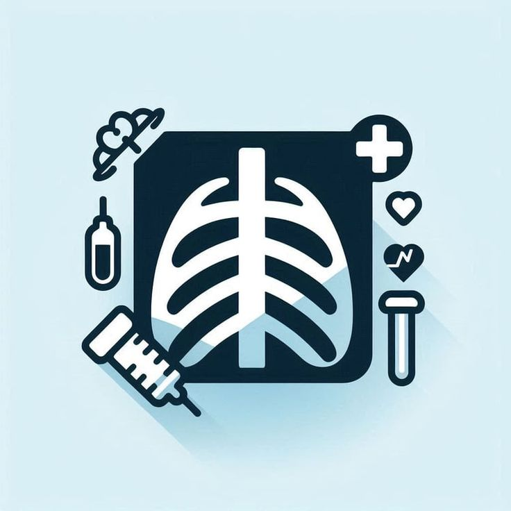

<div align="center">



# 🫁 AI Pediatric Pneumonia Detector

**A full-stack clinical decision support system for diagnosing pediatric pneumonia using dual AI pathways — DenseNet121 chest X-ray analysis and Gradient Boosting vital signs classification — built for deployment in resource-constrained healthcare environments.**

[](https://python.org)
[](https://streamlit.io)
[](https://tensorflow.org)
[](https://scikit-learn.org)
[](#license)

*University of Saida, Algeria · Academic Year 2025–2026*

</div>

---

## Table of Contents

1. [Project Overview](#1-project-overview)
2. [Clinical Motivation](#2-clinical-motivation)
3. [Diagnostic Capabilities](#3-diagnostic-capabilities)
4. [System Architecture](#4-system-architecture)
   - 4.1 [Three-Tier Design Model](#41-three-tier-design-model)
   - 4.2 [Component Interaction](#42-component-interaction)
   - 4.3 [Design Principles](#43-design-principles)
5. [Data Management & Storage](#5-data-management--storage)
   - 5.1 [Full Directory Hierarchy](#51-full-directory-hierarchy)
   - 5.2 [File Schemas](#52-file-schemas)
   - 5.3 [Session Management](#53-session-management)
   - 5.4 [Data Integrity Mechanisms](#54-data-integrity-mechanisms)
6. [AI Models](#6-ai-models)
7. [Medical Explainability Layer](#7-medical-explainability-layer)
8. [Feature Walkthrough](#8-feature-walkthrough)
9. [Project Structure](#9-project-structure)
10. [Installation & Setup](#10-installation--setup)
11. [Usage Guide](#11-usage-guide)
12. [Navigation Architecture](#12-navigation-architecture)
13. [Known Limitations & Roadmap](#13-known-limitations--roadmap)
14. [Team](#14-team)
15. [Acknowledgements](#15-acknowledgements)
16. [Technical Notes](#16-technical-notes)
17. [License](#17-license)

---

## 1. Project Overview

**AI Pediatric Pneumonia Detector** is a comprehensive clinical decision support (CDS) application developed at the **University of Saida, Algeria**. The system assists pediatric clinicians in diagnosing community-acquired pneumonia (CAP) in children aged **1 to 16 years** through two independent, complementary AI pathways: structured vital signs analysis and chest X-ray image interpretation.

The application covers the full clinical workflow end-to-end:

- **Doctor onboarding** with profile management and session control
- **Patient registration** with structured records and optional document attachments
- **Dual AI diagnostics** — vital signs (ML) and chest X-ray (deep learning)
- **Evidence-based explanations** for every AI prediction, cited to peer-reviewed literature
- **Treatment plan generation** for both outpatient home management and inpatient hospital care
- **Real-time nurse monitoring** tables with configurable interval timers

All data is stored in a **zero-infrastructure, file-based persistence layer** — no database server required — making the system deployable in clinics with minimal IT support.

---

## 2. Clinical Motivation

Pneumonia is a leading cause of mortality in children under five globally. In low- and middle-income countries, diagnostic delays caused by limited access to specialist radiologists and diagnostic equipment significantly worsen outcomes. This project addresses that gap by:

- Deploying AI-assisted screening at the **point of care**, not requiring remote specialist consultation
- Combining **structured clinical data** (vital signs) with **radiological data** (chest X-rays) for cross-validated diagnosis
- Providing **clinically referenced explanations** that turn AI outputs into actionable guidance for junior doctors and general practitioners
- Designing for **offline, low-infrastructure deployment** — the system runs anywhere Python runs, with no internet connectivity required after installation

---

## 3. Diagnostic Capabilities

| Diagnostic Pathway | Input | AI Model | Output |
|---|---|---|---|
| **Vital Signs Diagnostic** | 12 clinical parameters (temperature, SpO₂, cough type, fever severity, shortness of breath, chest pain, fatigue, confusion, crackles, sputum color, age, gender) | Gradient Boosting Classifier (`Gradient_Boost.pkl`) | Sick / Not Sick + confidence % + risk score (0–100) + per-feature clinical explanation |
| **Chest X-Ray Diagnostic** | Pediatric chest X-ray image (PNG / JPG / BMP / TIFF) | DenseNet121 CNN (`densenet121_best_model.keras`) | PNEUMONIA / NORMAL / uncertain + GradCAM heatmap overlay + radiological sign explanations |

**Key model performance indicators:**
- Gradient Boosting: Confusion identified as the single most predictive feature (**64.8% importance**); Fever second at 12.9%
- DenseNet121: Internal sensitivity **95.01%**, external validation sensitivity **97.21%**; classification threshold set at **0.260**

---

## 4. System Architecture

### 4.1 Three-Tier Design Model

The application follows an MVC-inspired layered architecture adapted for the Streamlit framework, with strict boundary enforcement between layers:

```
╔══════════════════════════════════════════════════════════════════╗
║                   TIER 1 — PRESENTATION LAYER                   ║
║  app.py (Home & Nav Hub)  ·  profile.py  ·  Add_Patient.py      ║
║  vitaldiagnostique.py  ·  xraydiagnostique.py                   ║
║  Treatment.py  ·  Hospitaltreatment.py  ·  About_Us.py          ║
╚══════════════════════════════╦═══════════════════════════════════╝
                               ║ function calls only
╔══════════════════════════════╩═══════════════════════════════════╗
║                TIER 2 — BUSINESS LOGIC & AI LAYER               ║
║  profile_db.py       ← Session management & auth boundary       ║
║  patient_db.py       ← Patient CRUD + PDF/CSV generation        ║
║  vitaldiagnostique_db.py  ← Append-only diagnostic records      ║
║  xraydiagnostique_db.py   ← X-ray image storage                 ║
║  treatment_db.py     ← Treatment plans + hospital monitoring    ║
║  whyvitals.py        ← Vital signs medical explanation engine   ║
║  whyxray.py          ← Radiology explanation dictionary         ║
║  Gradient_Boost.pkl  ← GBM inference (scikit-learn)             ║
║  DenseNet121.keras   ← CNN inference + GradCAM (TensorFlow)     ║
╚══════════════════════════════╦═══════════════════════════════════╝
                               ║ pathlib.Path file I/O
╔══════════════════════════════╩═══════════════════════════════════╗
║                  TIER 3 — PERSISTENCE LAYER                     ║
║  data/<Region-Hospital>/<DoctorName>/<PatientID_Name>/          ║
║  doctor_profile.csv  ·  N-vitaldiagnostic.csv                   ║
║  home_treatment.csv  ·  hospitalizedtreatment.csv               ║
║  Check Table N.csv   ·  xray/*.png  ·  *_pdf/ folders           ║
╚══════════════════════════════════════════════════════════════════╝
```

### 4.2 Component Interaction

The `app.py` entry point verifies doctor session status via `profile_db.py` before granting access to any protected page. Each feature page calls its dedicated `*_db.py` module for all data operations. AI inference is invoked directly from page scripts using `@st.cache_resource`-cached model objects loaded once at startup. The explanation engines (`whyvitals.py`, `whyxray.py`) are pure-Python modules with zero UI dependencies.

### 4.3 Design Principles

| Principle | Implementation |
|---|---|
| **Zero-infrastructure deployment** | No database server required. Runs on any machine with Python. |
| **Doctor-level data isolation** | All operations begin with `get_active_doctor_folder()` — architecturally impossible to access another doctor's data |
| **Append-only diagnostic history** | Sequential `N-vitaldiagnostic.csv` naming creates an immutable, forensically sound appointment record |
| **Human-readable records** | Every clinical record is a standard CSV openable in Excel without the application |
| **OS independence** | Exclusively uses `pathlib.Path` — identical behavior on Windows, macOS, and Linux |
| **Two-step save workflow** | Analyze and Save are separate actions — doctors review AI outputs before any file is written |
| **Late imports** | All `*_db.py` modules are imported inside function bodies to prevent circular dependencies |

---

## 5. Data Management & Storage

The system uses a **fully file-based persistence layer** built on Python's `pathlib` library. No database engine of any kind is used. All data lives under `data/` in a deterministic hierarchical structure.

### 5.1 Full Directory Hierarchy

```
AI-Pediatric-Pneumonia-Detector/
│
├── apppy/
│   └── .active_doctor                  ← Machine-level session file (hidden)
│
└── data/                               ← All persistent application data
    └── <Region><Hospital>/             ← e.g., CentralDistrict-StMetropolitanHospital/
        └── <lastname>-<firstname>/     ← e.g., smith-john/
            │
            ├── doctor_profile.csv      ← Doctor credentials (9 fields, single row)
            │
            └── <ID>_<First>_<Last>/    ← e.g., 1001_Aya_Ahmed/
                │
                ├── 1001_Aya_Ahmed.csv           ← Patient registration record (immutable)
                ├── 1001_Aya_Ahmed.pdf           ← Formatted registration PDF (ReportLab)
                │
                ├── 0-vitaldiagnostic.csv        ← First diagnostic session (19 fields)
                ├── 1-vitaldiagnostic.csv        ← Second diagnostic session
                ├── N-vitaldiagnostic.csv        ← N-th session (append-only, never overwritten)
                │
                ├── home_treatment.csv           ← All home treatment plans (append mode)
                ├── treatment_20260112_143022.pdf ← Generated treatment plan PDF
                │
                ├── hospitalizedtreatment.csv    ← Current hospitalisation record (overwrite)
                ├── Check Table 1.csv            ← First nurse monitoring interval
                ├── Check Table 2.csv            ← Second nurse monitoring interval
                ├── Check Table N.csv            ← N-th monitoring interval
                │
                ├── xray/
                │   └── 20260112_143022_001234_chest.png  ← Timestamped X-ray (µs precision)
                │
                ├── medical_history_pdf/         ← Uploaded prior medical records
                ├── family_history_pdf/          ← Uploaded hereditary condition records
                └── clinical_notes_pdf/          ← Uploaded specialist referral letters
```

### 5.2 File Schemas

#### `doctor_profile.csv` — Single-row, overwrite mode

| # | Field | Description |
|---|---|---|
| 1 | First Name | Doctor's given name |
| 2 | Last Name | Used in folder naming (sanitised via `_clean()`) |
| 3 | Email | Contact email |
| 4 | Phone Number | Contact phone |
| 5 | Degree | e.g., MD, PhD Radiology |
| 6 | Specialization | Medical specialisation field |
| 7 | Hospital | Institution name, used in folder construction |
| 8 | Region | Geographic region, combined with Hospital |
| 9 | Country | Country of practice |

#### `<ID>_<Name>.csv` — Patient registration, single-row, immutable

| # | Field | Type | Description |
|---|---|---|---|
| 1 | Patient ID | Integer | Auto-incremented from 1001 |
| 2–3 | First / Last Name | String | Patient name |
| 4–5 | Email / Phone | String | Guardian contact |
| 6 | Date of Birth | String | `mm/dd/yyyy` |
| 7 | Blood Type | Enum | A+/A-/B+/B-/AB+/AB-/O+/O- |
| 8 | Medical History | Long text | Previous illnesses, allergies, medications |
| 9 | Inherited Family Illnesses | Long text | Hereditary conditions |
| 10 | Critical Clinical Emphasis | Long text | Doctor's priority notes |
| 11 | Created At | ISO DateTime | `YYYY-MM-DD HH:MM:SS` |

#### `N-vitaldiagnostic.csv` — One file per appointment, append-only

| # | Field | Type | Notes |
|---|---|---|---|
| 1 | Appointment Index | Integer | N in filename |
| 2 | Timestamp | ISO DateTime | Exact session time |
| 3 | Patient Folder | String | Cross-reference |
| 4–14 | Vital Signs (×11) | Enum / Float | 12 encoded model features |
| 15 | Prediction (raw) | Integer | 0 = Not Sick, 1 = Sick |
| 16 | Prediction Label | String | Human-readable verdict |
| 17 | Confidence | String | Probability % or "N/A" |
| 18 | Clinical Notes | Long text | Optional doctor session notes |

> The 12 model input features include: Gender, Age, Cough type, Fever severity, Shortness of breath, Chest pain, Fatigue, Confusion (highest importance: **64.8%**), Oxygen saturation, Crackles, Sputum color, Temperature.

#### `home_treatment.csv` — Multi-row, append mode

Each row represents one treatment plan with: `treatment_id`, `timestamp`, `patient_id`, `patient_name`, `medications` (JSON list), `appointment_date`, `followup_notes`, `warning_signs` (JSON list), `emergency_risks`, `emergency_actions`, `emergency_must_know`, `emergency_history`.

#### `hospitalizedtreatment.csv` — Single-row, overwrite mode

Captures current hospitalisation episode: `diagnosis`, `admission_notes`, `instructions`, `progress_notes`, `medications` (pipe-delimited), discharge conditions (`discharge_cond`, `dc_notes`), and four boolean discharge readiness flags: `dc_spo2`, `dc_fever`, `dc_feeds`, `dc_xray_ok`.

#### `Check Table N.csv` — Per-interval nurse monitoring

15 WHO-aligned monitoring rows (Temperature, SpO₂, Crackles, etc.) plus optional doctor-defined custom columns. Fields: `#`, `Feature`, `Current Status`, `vs. Last Check` (trend), `Notes`, `[extra columns]`, `saved_at`.

#### X-Ray filename format

```
<YYYYMMDD>_<HHMMSS>_<ffffff>_<safe_original_name>.<ext>
 20260112    143022    001234   chest_xray          .png
```
Microsecond-precision timestamp ensures collision-free storage. Original filename is sanitised (non-`[alphanum/./\_/-]` replaced with `_`).

### 5.3 Session Management

The active doctor session is tracked via a hidden plain-text file:

```
AI-Pediatric-Pneumonia-Detector/apppy/.active_doctor
```

This file contains one line: the absolute path to the active doctor's data folder.

| Operation | Function | File Action |
|---|---|---|
| Login (profile save) | `save_doctor_profile()` | **Write** `.active_doctor` |
| Session check | `get_active_doctor_folder()` | **Read** — returns `Path` or `None` |
| Profile completeness test | `is_profile_complete()` | **Read** — gates all feature navigation |
| Logout | `logout_doctor()` | **Delete** `.active_doctor` |

> **Note:** `.active_doctor` is machine-local. Multiple Streamlit instances on the same machine share the same session. This is intentional for single-user clinical deployment but must be addressed before any multi-user rollout.

### 5.4 Data Integrity Mechanisms

| Mechanism | Description |
|---|---|
| **PermissionError gating** | Every `*_db.py` operation calls `get_active_doctor_folder()` first. No data access is possible without a valid session — even via direct programmatic calls. |
| **FileNotFoundError validation** | `get_patient_folder()` validates the folder exists AND matches the regex `r"^\d+[_\-]"`, preventing path traversal and cross-doctor access. |
| **FileExistsError collision guard** | Both `save_xray_image()` and `save_diagnostic_record()` check for file existence before writing, raising `FileExistsError` on collision. |
| **Return-tuple error propagation** | All save operations return `(success: bool, message: str, path: Optional[Path])` — exceptions are caught internally and never crash the Streamlit UI. |
| **UTF-8 encoding enforcement** | All CSV and text file operations specify `encoding="utf-8"` explicitly, ensuring correct handling of accented characters in Arabic-French patient names. |
| **Path sanitisation** | `_clean()` in `profile_db.py` and `re.sub(r"[^\w]", "_", ...)` in `xraydiagnostique_db.py` strip all OS-reserved and path-separator characters. |
| **Two-step save workflow** | Results are held in `st.session_state` after analysis. A separate explicit button press is required to write to disk, preventing accidental persistence of incorrect AI outputs. |

---

## 6. AI Models

### Gradient Boosting Classifier — Vital Signs

| Attribute | Detail |
|---|---|
| **File** | `models/Gradient_Boost.pkl` |
| **Framework** | scikit-learn 1.6.1 (serialised via `joblib`) |
| **Input** | 12-feature encoded vector (categoricals + numerics) |
| **Output** | Binary class (0 = Not Sick, 1 = Sick) + probability score |
| **Top feature** | Confusion — **64.8% importance** |
| **Loading** | `@st.cache_resource` + `joblib.load()` — loaded once at startup |

**Feature importance ranking (partial):** Confusion (64.8%) → Fever (12.9%) → Temperature (9.2%) → remaining 9 features.

### DenseNet121 CNN — Chest X-Ray

| Attribute | Detail |
|---|---|
| **File** | `models/densenet121_best_model.keras` |
| **Framework** | TensorFlow / Keras 2.x |
| **Input** | `(1, 224, 224, 3)` float32 normalised image tensor |
| **Output** | Sigmoid score [0, 1]; threshold at **0.260** |
| **GradCAM layer** | `conv5_block16_concat` (DenseNet121 final conv block) |
| **Internal sensitivity** | **95.01%** |
| **External validation sensitivity** | **97.21%** |
| **Loading** | `@st.cache_resource` + `tf.keras.models.load_model()` |

**GradCAM implementation:** Uses `TensorFlow GradientTape` with a dual-output gradient model following the standard Grad-CAM algorithm (Selvaraju et al., 2017). The heatmap is rendered as a 3-panel Matplotlib figure (original / heatmap / overlay) directly in the browser.

**Preprocessing pipeline:** Upload → PIL open → resize to 224×224 → RGB conversion → normalise to [0, 1] → expand dims → inference.

---

## 7. Medical Explainability Layer

A core design goal is that the system is not a black box. Every AI prediction is accompanied by clinically referenced, human-readable reasoning.

### `whyvitals.py` — Vital Signs Explanation Engine

A pure-Python medical knowledge base containing:

- **`FEATURE_EXPLANATIONS`** — maps every `(feature, value_or_range)` pair to a clinical note and literature reference (IDSA/ATS, WHO IMCI, BTS, NEJM EPIC study)
- **`INTERACTION_EXPLANATIONS`** — lambda-based rules detecting clinically significant multi-feature combinations (e.g., high fever + purulent sputum → bacterial pneumonia pattern)
- **`SCORE_WEIGHTS`** — mirrors model feature importance rankings for the 0–100 risk score
- **`VitalInput`** — a dataclass holding all 12 input parameters
- **`explain()`** — main entry point returning: `{verdict, score, summary, tags, interaction_notes, per_feature_explanations}`

> `whyvitals.py` has no Streamlit imports. It is a standalone medical reasoning library testable independently of the UI.

### `whyxray.py` — Radiology Explanation Dictionary

A static dictionary (`EXPLANATION_DICT`) for three prediction outcomes — `"pneumonia"`, `"normal"`, `"uncertain"` — each containing:

- `title` and `summary`
- List of relevant **radiological signs** with descriptions (consolidation, air bronchograms, peribronchial cuffing, pleural effusion, etc.)
- `clinical_note` with sensitivity/threshold information
- `sources` — full URLs to WHO, Stanford CheXNet, Radiopaedia, RSNA, and AJR publications

> The `"uncertain"` key is triggered programmatically when `abs(pred_score - 0.260) < threshold_margin`. It is not a model output — it is an explicit safety pathway for borderline cases.

---

## 8. Feature Walkthrough

### 👤 Doctor Profile Management
- Mandatory first-launch profile gate — all clinical features locked until profile is complete
- Professional credential form: name, degree, specialisation, hospital, region, country
- Automatic creation of doctor-namespaced directory on save (`data/<Region><Hospital>/<lastname>-<firstname>/`)
- Profile update overwrites `doctor_profile.csv` (no version history)
- Logout deletes `.active_doctor` session file but preserves all data on disk

### 🧒 Patient Registration
- Auto-incrementing patient ID starting at **1001** (scans existing folders, returns `max + 1`)
- Structured intake: demographics, DOB, blood type, medical history, family illnesses, clinical emphasis
- Optional PDF attachments at registration (medical history, family records, clinical notes)
- Patient folder scaffolded with 4 subfolders: `xray/`, `medical_history_pdf/`, `family_history_pdf/`, `clinical_notes_pdf/`
- Records are **immutable** once saved — no update or delete operations exist

### 🩺 Vital Signs Diagnostic
- Patient selector with live appointment counter display
- 12-field form split across two columns
- **Analyze** → encode inputs → run GBM → generate confidence + risk score → call `whyvitals.explain()` → display verdict with risk score tags and interaction flags
- All results held in `st.session_state["diag_result"]` for doctor review before saving
- **Save** → `_next_diagnostic_index()` scans for max N → creates `N-vitaldiagnostic.csv` → clears session state

### 🔬 Chest X-Ray Diagnostic
- Image upload with format validation (PNG / JPG / JPEG / BMP / TIFF)
- Preprocessing preview shown before inference
- **Run AI Diagnostic** → DenseNet121 inference → GradCAM via `GradientTape` → 3-panel Matplotlib figure (original / heatmap / overlay)
- Three verdict states: PNEUMONIA / NORMAL / uncertain (borderline)
- `whyxray.py` section with radiological signs, clinical notes, and cited references
- **Save X-Ray** → microsecond-timestamp filename → raw bytes written to `patient/xray/`

### 💊 Treatment Planning — Home Management
- Dynamic medication list (add/delete rows): name, dosage, schedule, duration
- Next appointment date picker + follow-up notes
- Dynamic emergency warning signs list with parent instructions
- Four-section emergency handover plan (risks, actions, must-know, history)
- `TreatmentDB.save_treatment()` → appends row to `home_treatment.csv` + generates branded `treatment_<timestamp>.pdf`

### 🏥 Treatment Planning — Hospital Management
- **Static data** section: diagnosis, admission notes, nursing instructions, progress notes, medications, discharge criteria + four boolean readiness flags (SpO₂ stability, fever-free 24h, oral feeds tolerated, improved X-ray)
- **Real-time nurse monitoring**: configurable interval timer (seconds / minutes / hours) using `sleep(1)` + `st.rerun()` loop — generates a new `Check Table N.csv` at each interval
- 15 WHO-aligned monitoring parameters per table + doctor-configurable custom columns
- Each table has an independent Save button

---

## 9. Project Structure

```
AI-Pediatric-Pneumonia-Detector/
│
├── apppy/                              ← Main application package
│   ├── app.py                          ← Entry point, home screen, nav hub, session gate
│   ├── profile_db.py                   ← Auth boundary, session management, folder routing
│   ├── patient_db.py                   ← Patient CRUD: CSV + PDF + folder scaffolding
│   ├── vitaldiagnostique_db.py         ← Vital sign diagnostic persistence (sequential CSVs)
│   ├── xraydiagnostique_db.py          ← X-ray image storage + patient listing
│   ├── treatment_db.py                 ← Treatment CSV + PDF (home & hospital)
│   ├── whyvitals.py                    ← Medical explanation engine for vital predictions
│   ├── whyxray.py                      ← Radiology explanation dictionary for X-ray predictions
│   ├── .active_doctor                  ← Runtime session file (auto-generated, hidden)
│   │
│   └── pages/
│       ├── Add_Patient.py              ← Patient registration form
│       ├── vitaldiagnostique.py        ← Vital signs form + GBM inference + save
│       ├── xraydiagnostique.py         ← X-ray upload + DenseNet121 + GradCAM + save
│       ├── Treatment.py                ← Treatment mode selector + home treatment form
│       ├── Hospitaltreatment.py        ← Hospital admission plan + live nurse monitoring
│       ├── profile.py                  ← Doctor profile create/update form
│       └── About_Us.py                 ← Team information
│
├── models/
│   ├── densenet121_best_model.keras    ← Fine-tuned DenseNet121 (TF/Keras)
│   ├── Gradient_Boost.pkl             ← Trained GBM classifier (scikit-learn/joblib)
│   └── gradcam.py                     ← Standalone GradCAM utility (development reference)
│
├── data/                               ← Runtime data store, auto-generated at first profile save
│   └── <Region><Hospital>/
│       └── <lastname>-<firstname>/
│           └── ... (see §5.1)
│
└── assets/
    └── logo.png                        ← Application logo
```

---

## 10. Installation & Setup

### Prerequisites

- Python 3.11 or higher
- `pip`
- The two trained model files (see §3) placed in `models/`

### 1. Clone the Repository

```bash
git clone https://github.com/<your-username>/ai-pediatric-pneumonia-detector.git
cd ai-pediatric-pneumonia-detector
```

### 2. Install Dependencies

```bash
pip install streamlit tensorflow scikit-learn opencv-python pillow \
            numpy matplotlib reportlab joblib
```

Or with a requirements file:

```bash
pip install -r requirements.txt
```

### 3. Verify Model Files

```
models/
├── densenet121_best_model.keras    ← Required — DenseNet121 (TensorFlow/Keras)
├── Gradient_Boost.pkl             ← Required — GBM classifier (scikit-learn)
└── gradcam.py                     ← Standalone utility (development reference)
```

> Both model files must be present before launching. The application loads them at startup via `@st.cache_resource`. A missing model file will raise a `FileNotFoundError` on first diagnostic use.

### 4. Run the Application

```bash
streamlit run apppy/app.py
```

The application opens in your browser at `http://localhost:8501`.

### First Launch

On first run, the home screen will display a profile warning and all clinical features will be locked. Navigate to **Profile**, complete the form, and press **Save Changes**. Your personal data directory will be created automatically under `data/`.

---

## 11. Usage Guide

### Step 1 — Complete Your Doctor Profile

Navigate to **Profile** and fill in your credentials (name, degree, specialisation, hospital, region, country). Press **Save Changes**. This creates your personal `data/<Region><Hospital>/<lastname>-<firstname>/` directory and writes `doctor_profile.csv`. All features become accessible.

### Step 2 — Register a Patient

Click **Add Patient** from the home screen. Complete the intake form (demographics, DOB, blood type, clinical background). Optionally attach PDFs for medical history, family illnesses, or clinical notes. Press **Save**. A patient folder is created with a unique ID (starting at 1001), along with an immutable CSV and formatted PDF record.

### Step 3 — Run a Diagnostic

Click **Vital Diagnostic** or **X-Ray Diagnostic** from the home screen and select a patient.

**Vital Signs:**
1. Enter all 12 clinical parameters across the two-column form
2. Press **Analyze** — the GBM model runs and `whyvitals.explain()` generates a full clinical breakdown with risk score, tags, and interaction warnings
3. Review the output — results are displayed but not yet saved
4. Press **Save Diagnostic** to write `N-vitaldiagnostic.csv` to the patient folder

**Chest X-Ray:**
1. Upload a chest X-ray image (PNG, JPG, BMP, or TIFF)
2. Press **Run AI Diagnostic** — DenseNet121 classifies the image and GradCAM produces the heatmap overlay
3. Review the 3-panel figure and `whyxray.py` radiological explanation
4. Press **Save X-Ray** to write the timestamped image to `patient/xray/`

### Step 4 — Create a Treatment Plan

Click **Treatment** from the home screen. Select the patient and choose treatment mode:

**Home Treatment:** Fill in the medication list, next appointment date, follow-up notes, emergency warning signs, and the four-section emergency handover plan. Press **Save** — `home_treatment.csv` is updated and a branded PDF is generated.

**Patient Hospitalized:** The app routes to the hospital management page. Complete the static admission section (diagnosis, nursing instructions, discharge criteria). Start the nurse monitoring timer (configurable interval) — new `Check Table N.csv` files are generated at each interval. Each table has 15 WHO-aligned monitoring rows and can include custom columns.

---

## 12. Navigation Architecture

Navigation uses Streamlit's native multi-page architecture with custom `st.switch_page()` routing. The sidebar is hidden by CSS. All navigation is button-driven and gated behind `is_profile_complete()`.

| Source Page | Trigger | Destination | Condition |
|---|---|---|---|
| `app.py` | Add Patient button | `pages/Add_Patient.py` | Profile complete |
| `app.py` | Vital Diagnostic button | `pages/vitaldiagnostique.py` | Profile complete |
| `app.py` | X-Ray Diagnostic button | `pages/xraydiagnostique.py` | Profile complete |
| `app.py` | Treatment button | `pages/Treatment.py` | Profile complete |
| `Treatment.py` | Patient Hospitalized radio | `pages/Hospitaltreatment.py` | Patient selected |
| Any page | Back to Home | `app.py` | Always |
| `profile.py` | Save Changes (success) | `app.py` | After 2 s delay |

Inter-page data passing uses `st.session_state` — `Treatment.py` stores `selected_patient_folder` before calling `st.switch_page()`, which `Hospitaltreatment.py` reads on load to resolve the full patient path.

---

## 13. Team

| Name | Role | Institution |
|---|---|---|
| **Dr. Abderrahmane Khiat** | Project Supervisor | University of Saida, Algeria |
| **Miloudi Maroua Amira** | Fullstack Developer & Business Model | University of Saida, Algeria |
| **Bouhmidi Amina Maroua** | Data Engineer | University of Saida, Algeria |
| **Labani Nabila Nour El Houda** | Deep Learning Engineer | University of Saida, Algeria |
| **Kassouar Fatima** | ML Engineer | University of Saida, Algeria |
| **Dr. Aimer Mohammed Djamel Eddine** | Medical Advisor | CHU Saida, Algeria |

---

## 14. Acknowledgements

- **Labani Nabila Nour El Houda** — DenseNet121 fine-tuning, GradCAM implementation, and model training pipeline  
  GitHub: [@labaninabila193-code](https://github.com/labaninabila193-code)

- **Bouhmidi Amina Maroua** — Dataset preprocessing and data engineering pipeline  
  GitHub: [@AminaMar](https://github.com/AminaMar)

- **Kassouar Fatima** — Gradient Boosting model development, CSV preprocessing pipeline, and `whyvitals.py` medical explanation engine  
  GitHub: [@fatimakassouar](https://github.com/fatimakassouar)

Medical references embedded in the explanation engines:
- WHO IMCI (Integrated Management of Childhood Illness) guidelines
- IDSA/ATS Community-Acquired Pneumonia guidelines
- British Thoracic Society (BTS) Paediatric Pneumonia guidelines
- NEJM EPIC study (Etiology of Pneumonia in the Community)
- Selvaraju et al. (2017) — Grad-CAM: Visual Explanations from Deep Networks
- Stanford CheXNet (Rajpurkar et al., 2017)

---

## 15. Technical Notes

- The `whyvitals.py` risk score (0–100) is an **internal interpretability metric** computed from `SCORE_WEIGHTS` and is not directly equivalent to the Gradient Boosting model's probability output. They are complementary — the score contextualises the prediction for the clinician.
- The `"uncertain"` outcome in `whyxray.py` is not returned by the DenseNet121 model directly. It is triggered in `xraydiagnostique.py` when `abs(pred_score - 0.260) < threshold_margin`. Tuning this margin is a deployment-time decision.
- Both `whyvitals.py` and `whyxray.py` are **stateless pure-Python modules** with no Streamlit imports. They can be imported, tested, and used in any Python context (REST API, CLI, unit tests) without modification.
- `VitalInput` dataclass in `whyvitals.py` expects `Age` as `int` (1–16) and `Oxygen_saturation` / `Temperature` as `float`. Passing string values will raise `AttributeError` from `getattr` in `_compute_score()`.
- Patient ID generation (`generate_patient_id()`) is O(N) — it scans all patient folders to find the current maximum. This is called once at registration and is acceptable for N < 1,000 patients per doctor. Beyond that, a persisted counter is advisable.
- All X-ray images are saved as **raw bytes** with no format conversion — original image fidelity is fully preserved.
- The nurse monitoring timer in `Hospitaltreatment.py` uses `sleep(1)` + `st.rerun()` within Streamlit's reactive rendering model. This is a stateful loop pattern; `st.session_state` holds all timer state.

---

## 16. License

This project was developed as an academic capstone at the **University of Saida, Algeria, Academic Year 2025–2026**. All rights reserved by the project team. Contact the supervisor for usage permissions.

---

<div align="center">

*University of Saida, Algeria · 2025–2026*  
*Powered by DenseNet121 · Gradient Boosting · Medically-Referenced AI Explainability*

</div>
